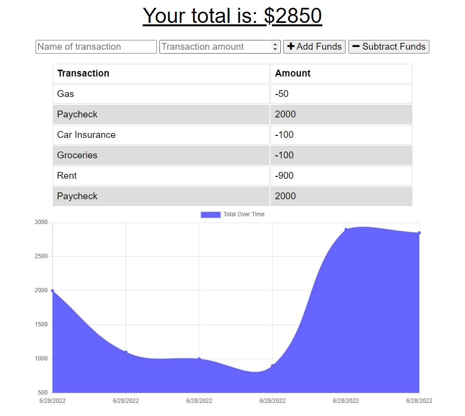
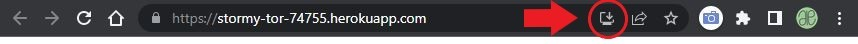
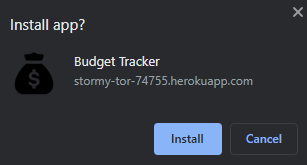
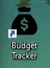
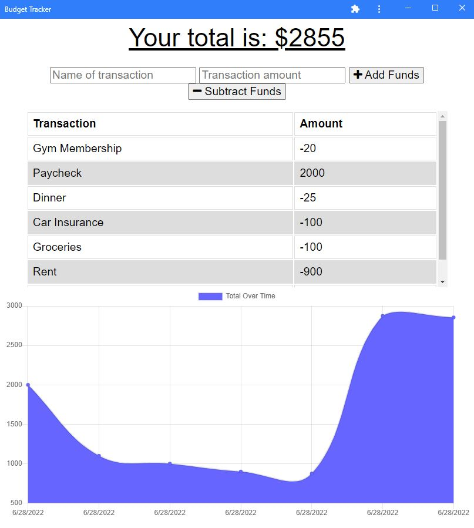
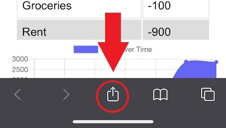
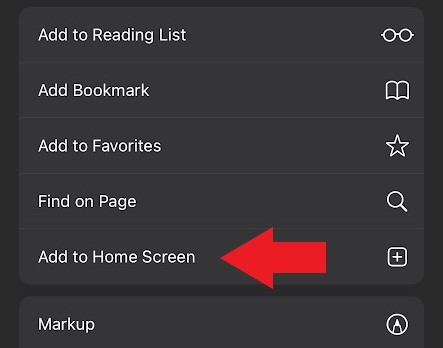
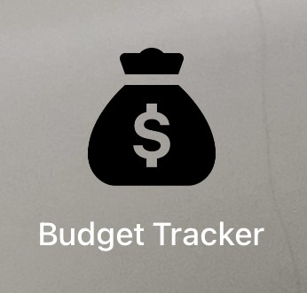
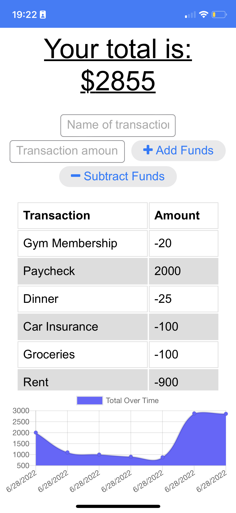

# Budget Tracker

## Table-of-Contents

- [Description](#description)
- [Deployed Site](#deployed-site)
- [Features](#features)
- [Technologies](#technologies)
- [Future Development](#future-development)
- [Credits](#credits)

## Description

Budget Tracker was built by taking an existing budget-tracker application and updating it to allow for offline access and functionality. I add these features using tools such as IndexedDB, Service Workers, and Web Manifests.

With this new verison of the application, users can now add expenses and deposits to their budget with or without an internet connection. If the user enters transactions offline, the total will update once they are brought back online.

## Deployed Site

Follow [this link](https://stormy-tor-74755.herokuapp.com/) to view and use my site!

## Features

This is how the page appears to viewers. It is responsive, adapting to multiple screen sizes. Using this application, users can enter transactions through the form at the top, clicking the appropriate submission button for if they wish to subtract or add the funds from their budget.

The graph pictured at the bottom updates in real time, showing the user their budgeting history over time. Users are also able to download this application and use its features offline. Once the application reconnects to an internet connection, any changes the user made while disconnected will update automatically.

To download this application, follow the instructions below:

Desktop:

1. Click on the download button in the address bar on the right-hand side.

2. A popup window will appear, asking you if you want to install the application. Click "Install" to proceed.

3. Once installed to your desktop, a shortcut icon will appear on your desktop.

4. At the same time, the newly downloaded application will appear in it's own window as a standalone application.

Mobile:

1. After opening the deployed website in your mobile browser, click on the share icon at the bottom of the screen.

2. This will open a menu. Select the option that says "Add to Home Screen".

3. The following icon will appear on your home screen with your other applications.

4. If you open the application from the home screen, it will open the app as a standalone application.

## Technologies

- HTML
- CSS
- JavaScript
- Node.js
- [Express.js](https://expressjs.com/)
- npm
- MongoDB
- [Mongoose.js](https://mongoosejs.com/)

## Future Development

In the future, I would like to add the following improvements:

- Categories for each of the transactions so that users can see what types of things they spend more money on in a given period of time.
- It would be cool to add a feature where users can sync their bank accounts so that their budget updates automatically with each transaction.
- Down the road, I'd like to add more involved graphs or features that help the user analyze their spending habits over time.

I'm always interested in refactoring code to improve it's functionality. If you would like to suggest your own improvements, you can reach me at the links below.

- <a href="mailto:ashleylynnsmith.dev@gmail.com">Email</a>
- <a href="https://github.com/ashlynn4567">GitHub</a>
- <a href="https://www.linkedin.com/in/ashley-lynn-smith/">LinkedIn</a>

## Credits

This project was built with the help of the University of Oregon's Coding Boot Camp.

## Licensing

The application is covered under the following license: [MIT](https://opensource.org/licenses/MIT)
